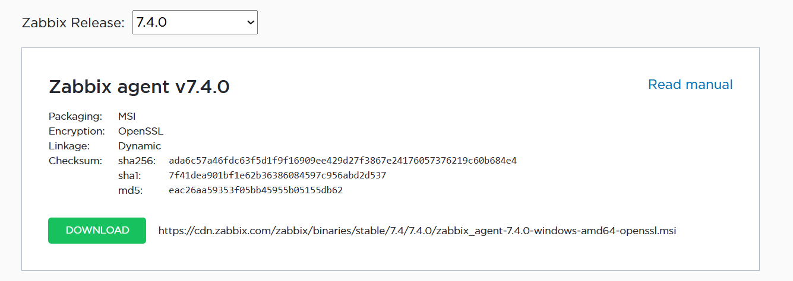
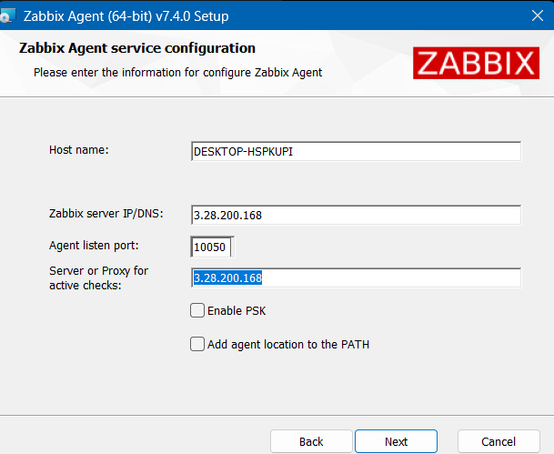
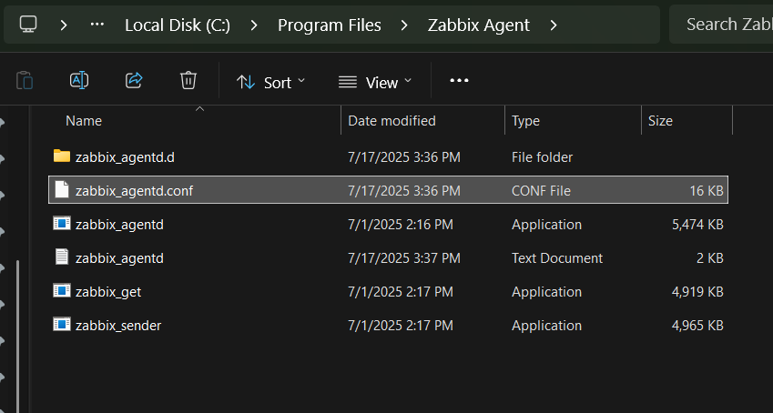
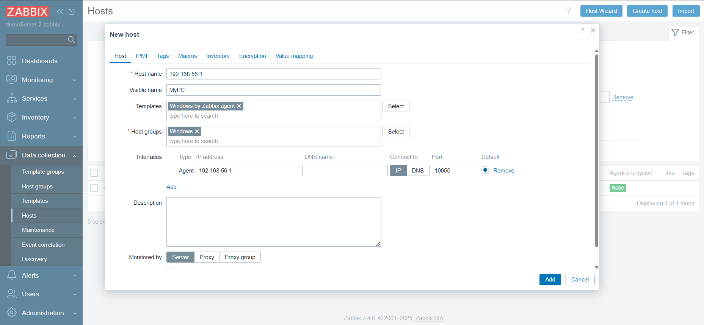
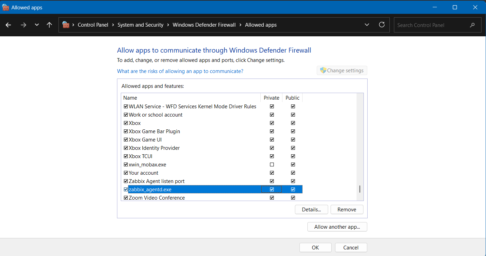

## Zabbix Agent Installation in Windows

**Here We want to Install the Zabbix agent that match with Zabbix server.**

1. Go to following link and download the agent, not version 2.
   https://www.zabbix.com/download_agents

Here, If we want to change anything in this config file like server IP or server name, Just change that and
Go-to Services: `Win+R` type `services.msc`
and Restart the Zabbix agent.

After that We want to configure this agent with zabbix server to getting data.

_Check in zabbix server is listing on port 10051_
`sudo ss -tulnp | grep 10051`

| Direction                                           | Test                                                                     | Result                   |
| --------------------------------------------------- | ------------------------------------------------------------------------ | ------------------------ |
| Windows → Zabbix Server (port 10051)                | `Test-NetConnection -ComputerName <zabbix server public ip> -Port 10051` | ✅ Successful            |
| Ubuntu (Zabbix Server) → Windows Agent (port 10050) | `telnet <internal-ip-zabbix-agent> 10050`                                | ✅ Connected (port open) |

Start & stop zabbix agen in powershell
`net stop "Zabbix Agent"`
`net start "Zabbix Agent"`

Edit zabbix_agentd.conf on your Windows machine:
`Server=3.28.200.168(zabbix server public ip),172.31.10.84(zabbix server private ip)`

