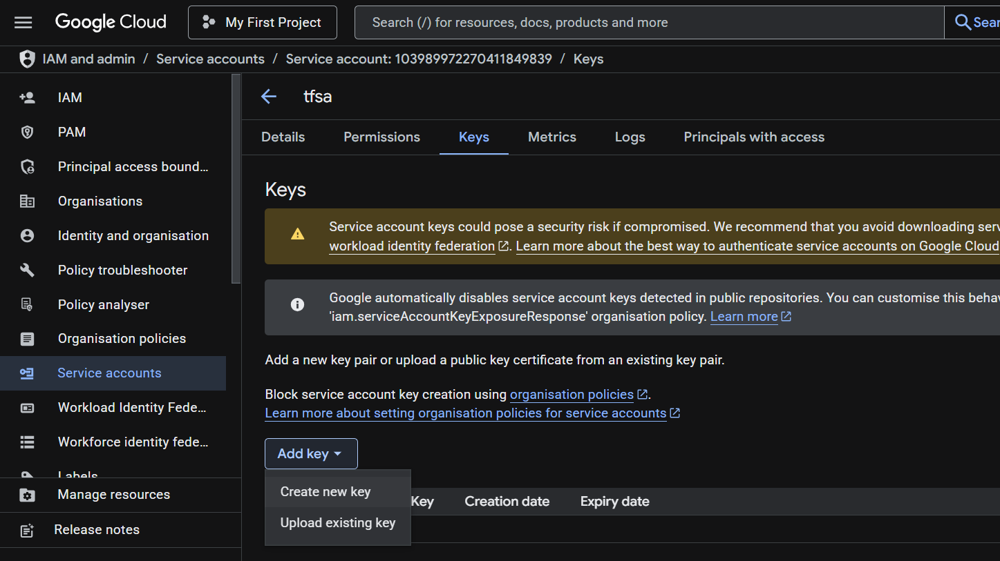

# GCP FROM Terraform

## Configure terraform with gcp account

The following setup for the account with Organization,

1. create a service account
2. allow required permission based on the task.
3. Generate the key
   
4. Put the key in the terraform folder and in provider.json put as following
   ```
   provider "google" {
   credentials = file("key.json")
   }
   ```

Here, I have the account with No organization, so here no nned to do following service account setup.So , I can use my own owner account for this terraform setup, by

1. Authenticates your personal user account (Google login)
   We can provide credentials to ADC by running the `gcloud auth application-default login` command. This command creates a JSON file containing the credentials you provide and places it in a well-known location on your file system.

- Linux, macOS: $HOME/.config/gcloud/application_default_credentials.json
- Windows: %APPDATA%\gcloud\application_default_credentials.json

The provider code will be looks like following:

```
provider "google" {
  region  = var.region
  project = var.project_id # This will exist after project is created, but is still required here
}
```

Here, this region will be the default region, The region here sets a default region for Google Cloud resources that require it, like:
google_compute_instance (VM), google_cloud_run_service, google_sql_database_instance and others that are regional

Note ->
Why It’s Okay to Keep the project creation code, even if we aadd new resourses?
Terraform tracks your resources using a state file.

When you re-run terraform apply, it checks what already exists in the state and only makes changes if needed.

So if the project already exists and hasn't changed, Terraform just skips re-creating it.
